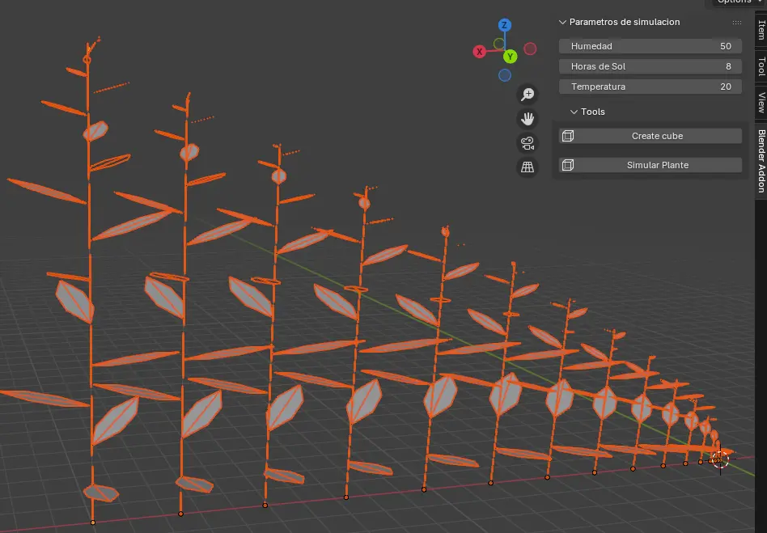

# Blender Add-on (L-system)

## Herramientas(core)

 

### Repositorios
- [L-system](https://github.com/krljg/lsystem)

- [Blender-Addon-Template](https://github.com/doramgajo/blender-addon-template)

- [Lpy](https://github.com/openalea/lpy/tree/master)
- [Lpy-Docs](https://lpy.readthedocs.io/en/latest/)

- [xarray-simlab](https://github.com/xarray-contrib/xarray-simlab)

- [PlantGL and L-Py Jupyter widgets](https://github.com/fredboudon/plantgl-jupyter)

- [vmango-lab](https://github.com/jvail/vmango-lab)


## Instalación

La guia completa se encuentra en el repositorio del [template](https://github.com/doramgajo/blender-addon-template) 

El addon esta pensado para ser **descargado como " .zip " y arrastrado al entorno de blender** para instalarse (Blender ~3.6)

**DISCLAIMER**

Actualmente se necesita una copia de la carpeta L-system dentro de "/addons/" 
para el correcto funcionamiento en Blender ~ 4.5


#### Que es esto?

Este desarrollo contiene una extension de la libreria "L-system" usando 
el "addon template" como base para construir metodos enfocados en generar modelos paleobotanicos
mediante las técnicas:

- Pariente Vivo más Cercano (PVC)
- Aproximación Morfológico Estructural (AME)

[1]

## Capturas en funcionamiento
- v.0.1

En esta version se implementa el desarrollo basico de un ejemplar de capsella bursa pastoris
Solo se incluyen 3 variables de influencia a la simulacion del L-system con parametros.

```
Capsella Bursa-Pastoris L-system simulation.
See figure 3.5 in 'Algorithmic Beauty of Plants 
(http://algorithmicbotany.org/papers/abop/abop.pdf)
page 74
```
[3]

<p align="center">

</p>

## Estructura de carpetas 

Este es un ejemplo del arbol de carpetas que podrias ver si entras a la carpeta de addons de **Blender**
<!-- > [!NOTE] -->
<pre>
4.5/scripts/
    └── addons/
        ├── addon_pre_exist.py  # Single-file add-on
        └── addon_test_folder/  # Carpeta creada por blender
            ├── __init__.py
            ├── other_module.py
            └── ...
</pre>


### Formacion Paleobotánica en México (selected?)

[Formación Olmos - COAH](https://paleobiologia.wixsite.com/evolucionplantae/formacion-olmos)

Muchas de las angiospermas y coníferas descritas en la Formación Olmos eran endémicas de México y muchas otras estaban restringidas en América del Norte (Weber, 1972, 1978; Estrada-Ruiz et al., 2007, 2008).

Los estudios de Weber (1972) ponen de manifiesto una dominancia de angiospermas dicotiledóneas con una gran biodiversidad (60 morfoespecies de las 80 morfoespecies de plantas fósiles observadas) que incluyen dentro de las monocotiledóneas posibles miembros de la familias Araceae (Pistia) y Arecaceae (Phoenicites Brongniart y Sabalites Saporta), y dentro de las dicotiledóneas, además de algunas indeterminadas, miembros de Magnoliaceae (Liriodendron Linnaeus), Lauraceae (Sassafras Nees y Eberm), Moraceae (Artocarpus Forster y Forster), Betulaceae (Betula Linnaeus), y Rhamnaceae (Zizyphus Linnaeus), además de los órgano-géneros Liriodendropsis Newberry y Manihotites Berry. Las localidades donde fueron estudiados cada uno de los fósiles de plantas descritos por Weber (1972) están reportadas en mayor detalle en Barrera-Escorcia (1982). Estrada-Ruiz et al. (2011) describieron en el Tajo el Nogalito en el Municipio de Múzquiz, un nuevo género y especie de angiosperma acuática (Exnelumbites callejasiae) relacionada con la Familia **Nelumbonaceae**. Del análisis de un total de 35 tipos distintos de hojas de eudicotiledóneas en la Formación Olmos, prevalece el orden Laurales y en menor proporción cf. Menispermaceae y **Nelumbonaceae** (Estrada-Ruiz et al., 2008).

[Síntesis de los trabajos paleobotánicos del Cretácico en México](https://www.scielo.org.mx/scielo.php?script=sci_arttext&pid=S1405-33222014000100009)

### PaleoBioDB

[ThePaleobiology Database](https://paleobiodb.org/#/)
[Family Nelumbonaceae Richard 1827 (lotus)](https://paleobiodb.org/classic/basicTaxonInfo?taxon_no=txn:55399)


### Eq-aciones

1.10.1 Parametric OL-systems - p.p. 41

The sets of all correctly constructed logical and arithmetic 
expressions with parameters from Σ are noted C(Σ) and E(Σ).

A parametric OL-system is defined as an ordered quadruplet G = Parametric
<V, Σ, ω, P>, where OL-system
• V is the alphabet of the system,
• Σ is the set of formal parameters,
• ω ∈ (V × R(?)∗)+ is a nonempty parametric word called the axiom,
• P ⊂ (V × Σ∗) × C(Σ) × (V × E(Σ))∗ is a finite set of productions
The symbols : and → are used to separate the three components of a
production: the predecessor, the condition and the successor.

For example, a production with predecessor A(t), condition t > 5 and successor
B(t + 1)CD(t ∧ 0.5, t − 2) is written as
A(t) : t > 5 → B(t + 1)CD(t ∧ 0.5, t − 2). (1.6)
Derivation A production matches a module in a parametric word if the following
conditions are met:
• the letter in the module and the letter in the production predecessor are the same,
• the number of actual parameters in the module is equal to the
number of formal parameters in the production predecessor, and
• the condition evaluates to true if the actual parameter values are
substituted for the formal parameters in the production.
A matching production can be applied to the module, creating a string
of modules specified by the production successor. The actual parameter values are substituted for the formal parameters according to their
position. For example, production (1.6) above matches a module A(9),
since the letter A in the module is the same as in the production predecessor, there is one actual parameter in the module A(9) and one
formal parameter in the predecessor A(t), and the logical expression
t > 5 is true for t = 9. The result of the application of this production
is a parametric word B(10)CD(3, 7).
If a module a produces a parametric word χ as the result of a
production application in an L-system G, we write a → χ. Given a
parametric word µ = a1a2...am, we say that the word ν = χ1χ2...χm
is directly derived from (or generated by) µ and write µ =⇒ ν if and
only if ai → χi for all i = 1, 2, ..., m. A parametric word ν is generated
by G in a derivation of length n if there exists a sequence of words
µ0, µ1, ..., µn such that µ0 = ω, µn = ν and µ0 =⇒ µ1 =⇒ ... =⇒ µn.
Example An example of a parametric L-system is given below.
ω : B(2)A(4, 4)
p1 : A(x, y) : y <= 3 → A(x ∗ 2, x + y)
p2 : A(x, y) : y > 3 → B(x)A(x/y, 0)
p3 : B(x) : x < 1 → C
p4 : B(x) : x >= 1 → B(x − 1)

### Guias Paleobotany

- [Extinct_plants](https://github.com/PaleoNate/extinct_plants)

This is a place for the paleobotany and paleo-art communities to find references to papers with illustrations of extinct plants.

- [Paleobotanical-3D-reconstruction-guides Public](https://github.com/robertlmenning/Paleobotanical-3D-reconstruction-guides)

Paleobotany focused guides for segmenting, editing, and animating 3D reconstructions of plant fossils

- [Paleobotany-Books](https://github.com/manjunath5496/Paleobotany-Books)

"Now, evolution is the substance of fossils hoped for, the evidence of links not seen." ― Duane T. Gish

- [Paleobotany_research](https://github.com/BenjaminVanOttenberg/paleobotany_research)

### Referencias

[Relevance of the Coal Mining Deposits and the Olmos Formation in NE Mexico to Geoheritage: Scientific, Geological and Educational Attributes that Highlight its Conservation](https://link.springer.com/article/10.1007/s12371-025-01071-y)

```
[1] Plantas fósiles e inferencia paleoclimática: aproximaciones metodológicas 
y algunos ejemplos para México

Hugo I. Martínez-Cabrera 
José L. Ramírez-Garduño2
Emilio Estrada-Ruiz

Boletín de la Sociedad Geológica Mexicana
Volumen 66, núm. 1, 2014, p. 41-52
```


```
[2] Modelling the Plants and Ecosystem of the Rhynie Chert (2015)
Mark Kolesza
UNIVERSITY OF CALGARY
```

```
[3] The Algorithmic Beauty of Plants
- Przemyslaw Prusinkiewicz
- Aristid Lindenmayer

With:
James S. Hanan
F. David Fracchia
Deborah Fowler
Martin J. M. de Boer
Lynn Mercer
```

```
[4] Visual models of plant development (1996)
Przemyslaw Prusinkiewicz, Mark Hammel, Jim Hananz, and Radomir Mech
Department of Computer Science University of Calgary
Calgary, Alberta, Canada
zCSIRO - Cooperative Research Centre for Tropical Pest Management
Springer-Verlag 1996
```

```
Using L−Systems for Modeling the Architecture and Physiology of Growing Trees: 
The L−PEACH Model Mitch Allen (2004)

Przemyslaw Prusinkiewicz
Theodore DeJong

Department of Pomology, University of California, Davis
Department of Computer Science, University of Calgary
```

```
V-Mango: a functional–structural model of mango tree growth, development and fruit production 
Annals of Botany, Volume 126, Issue 4, 14 September 2020, Pages 745–763, https://doi.org/10.1093/aob/mcaa089
```

[Fossil Plants as Tests of Climate (Albert Charles Seward) - Sedgwick Essay Prize for the Year 1892](https://github.com/manjunath5496/Paleobotany-Books/blob/master/pale(3).pdf)