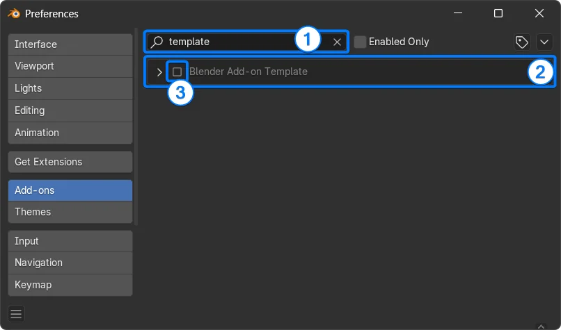

# Blender Add-on (L-system)

## Herramientas(core)

#### Repositorios usados
- [L-system](https://github.com/krljg/lsystem)

- [Blender-Addon-Template](https://github.com/doramgajo/blender-addon-template)

## Instalación

La guia completa se encuentra en el repositorio del template basico, el addon esta pensado para ser descargado como " .zip " y arrastrado al entorno de blender para instalarse

#### Que es esto?

Este desarrollo contiene una extension de la libreria "L-system" usando 
el "addon template" como base para desarrollar
la libreria esta enfocada en modelos paleobotanicos

##### Activate the addon

Search for your add-on and activate it.

## Custom scripts directory structure

Este es un ejemplo del arbol de carpetas que podrias ver si entras a la carpeta de addons de **Blender**
<!-- > [!NOTE] -->
<pre>
custom scripts directory/
    └── addons/
        ├── addon_exist.py      # Single-file add-on
        └── addon_test_folder/  # Folder-based add-on
            ├── __init__.py
            ├── other_module.py
            └── ...
</pre>